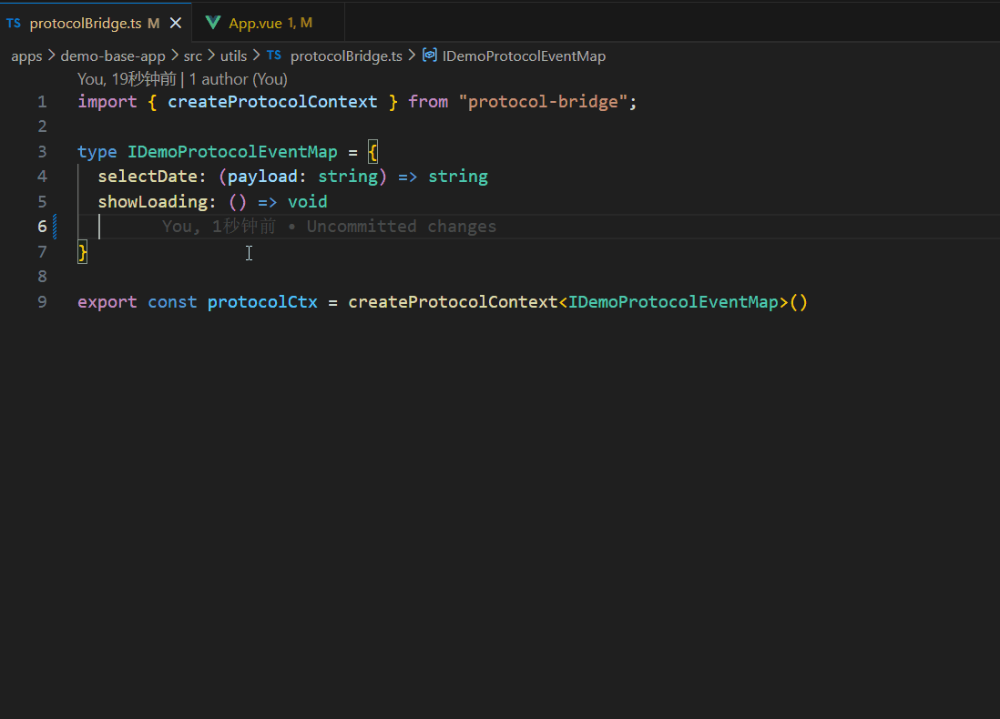
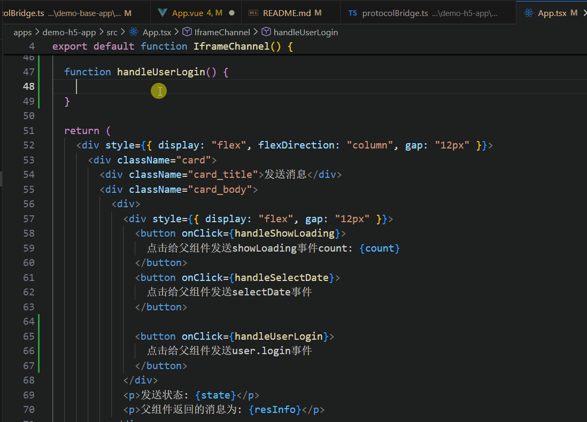

# protocol-bridge-monorepo

基座应用与h5应用之间进行postMessage通信的前端pnpm多包工程，有一个核心的通信协议实现包，一个通信协议typescript事件类型约束包，和用于demo测试该通信协议包的两个工程包，分别是h5应用工程和web基座工程；其中通信协议类型约束包可以被link到上述所有工程中，用于对通信协议和demo中注册的可用通信事件的约束。从而在应用阶段实现一旦需要新增或修改通信事件，只需要修改通信协议类型约束包中通信事件的类型定义，后续应用工程升级该包后，通过类型提示即可知道该如何变更应用的目的。

    在基座应用中添加事件监听



    在H5应用中触发事件




## 一、安装与运行

### 1.1 protocol-bridge和H5工程

```bash
# 安装
pnpm i

# 进入分包安装
cd packages/protocol-bridge/
pnpm i
# 运行
pnpm run build

cd apps/demo-h5-app/
pnpm i
pnpm run dev
```

### 1.2 web基座工程

```bash
cd apps/demo-base-app/
pnpm i
pnpm run dev
```

### 1.3 鸿蒙基座工程

- 鸿蒙工程示例接入的H5页面是本地资源，所以先需要打包H5工程到资源目录的resfile中

```bash
cd apps/demo-h5-app/
pnpm run build
```

- 通过 `DevEco Studio` 打开 `DemoHarmonyApp` 工程安装即可
- 如果构建不成功，可能是 `oh-package.json5` 中依赖的`@cqx/protocol_bridge`包地址不存在导致，可以先注释，构建完 `protocol_bridge` har包后，再解开注释使用。

> 由于鸿蒙工程不能引入 `npm` 包，所以 `protocol_bridge` 是工程中的一个 `har` 包，其代码实现与 `npm` 包一致。
> 鸿蒙的 `@cqx/protocol_bridge` 包会发布到 OpenHarmony三方库中心仓 ，通过安装使用

## 二、包的发布

### 2.1 npm包的发布

> 注意：先修改package.json中的版本号，CHANGELOG.md中的变更日志

```bash
cd ./packages/protocol-bridge
# 查看并切换镜像源
nvr ls
nvr use npm

# 登录 npm
npm login

# 构建项目
npm run build

# 发布
npm publish

# 如果是首次发布，可能需要
npm publish --access public
```

### 2.2 鸿蒙ohpm包的发布

参考

- [发布共享包](https://developer.huawei.com/consumer/cn/doc/harmonyos-guides/ide-har-publish)
- [[鸿蒙学习计划] 如何发布 第三方库到 OpenHarmony](https://developer.huawei.com/consumer/cn/forum/topic/0203154124929026022)

ohpm包的发布，对README.md、CHANGELOG.md 和 LICENSE 这个三个文件有较严格的审核要求，包括版本号，更新日志，作者名等等
